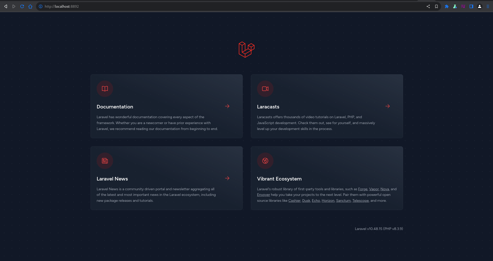

<div style="width:100%;float:left;clear:both;margin-bottom:50px;">
    <a href="https://github.com/pabloripoll?tab=repositories">
        
    </a>
</div>

<div style="width:100%;float:left;clear:both;margin-bottom:50px;">
    
</div>

# Docker Laravel 10 + JWT with PHP FPM 8+

The objective of this repository is having a CAAS [Containers As A Service](https://www.ibm.com/topics/containers-as-a-service) to provide a local development stage application with Nginx and PHP-FPM as Backend Service and a SQL Database Service following the best practices on an easy scenario to understand and modify in an Hexagonal Architecture.

## Backend Docker Container Service

- [Laravel 10.48.15](https://laravel.com/docs/10.x/releases)

- [PHP-FPM 8.3.8](https://www.php.net/releases/8.0/en.php)

- [Nginx 1.26.1](https://nginx.org/)

- [Alpine Linux 3.20](https://www.alpinelinux.org/)

## Database Docker Container Service

This repository has been updated including a database container service to test the backend application to simulate an database instance in development stage.

- [MariaDB 10.11.6-r0](https://mariadb.com/kb/en/changes-improvements-in-mariadb-1011/)

- [Alpine Linux 3.20](https://www.alpinelinux.org/)

## Project objetives with Docker

* Built on the lightweight and secure Alpine 3.20 [2024 release](https://www.alpinelinux.org/posts/Alpine-3.20.0-released.html) Linux distribution
* Multi-platform, supporting AMD4, ARMv6, ARMv7, ARM64
* Very small Docker image size (+/-40MB)
* Uses PHP 8.0 as default for the best performance, low CPU usage & memory footprint, but also can be downgraded till PHP 8.0
* Optimized for 100 concurrent users
* Optimized to only use resources when there's traffic (by using PHP-FPM's `on-demand` process manager)
* The services Nginx, PHP-FPM and supervisord run under a project-privileged user to make it more secure
* The logs of all the services are redirected to the output of the Docker container (visible with `docker logs -f <container name>`)
* Follows the KISS principle (Keep It Simple, Stupid) to make it easy to understand and adjust the image to your needs
* Services independency to connect the application to other database allocation

The connection between container is as [Host Network](https://docs.docker.com/network/drivers/host/) on `eth0`, thus both containers do not share networking or bridge configuration.

As a client end user, both services can be accessed through `localhost:${PORT}` but to connect between them is through the `${HOSTNAME}:${PORT}` making configuration closest to a real scenario on production.

#### PHP config

To use a different PHP version from which has been set modify the following [Dockerfile](infrastructure/nginx-php/docker/Dockerfile) arguments and variable:
```Dockerfile
ARG PHP_VERSION=8.3
ENV PHP_V="php83"
```

Also, it has to be informed the [Supervisor Config](infrastructure/nginx-php/docker/config/supervisord.conf) the PHP-FPM version to run.
```bash
...
[program:php-fpm]
command=php-fpm83 -F
...
```

## Dockerfile overview
```
# Install main packages and remove default server definition
RUN apk add --no-cache \
  curl \
  wget \
  nginx \
  curl \
  zip \
  bash \
  vim \
  git \
  supervisor

RUN set -xe \
    && apk add --no-cache --virtual .build-deps \
        libzip-dev \
        freetype-dev \
        icu-dev \
        libmcrypt-dev \
        libjpeg-turbo-dev \
        libpng-dev \
        libxslt-dev \
        patch \
        openssh-client

# Install PHP and its extensions packages and remove default server definition
ENV PHP_V="php8"

RUN apk add --no-cache \
  ${PHP_V} \
  ${PHP_V}-cli \
  ${PHP_V}-ctype \
  ${PHP_V}-curl \
  ${PHP_V}-dom \
  ${PHP_V}-fileinfo \
  ${PHP_V}-fpm \
  ${PHP_V}-gd \
  ${PHP_V}-intl \
  ${PHP_V}-mbstring \
  ${PHP_V}-opcache \
  ${PHP_V}-openssl \
  ${PHP_V}-phar \
  ${PHP_V}-session \
  ${PHP_V}-tokenizer \
  ${PHP_V}-soap \
  ${PHP_V}-xml \
  ${PHP_V}-xmlreader \
  ${PHP_V}-xmlwriter \
  ${PHP_V}-simplexml \
  ${PHP_V}-zip \
  # Databases
  ${PHP_V}-pdo \
  ${PHP_V}-pdo_sqlite \
  ${PHP_V}-sqlite3 \
  ${PHP_V}-pdo_mysql \
  ${PHP_V}-mysqlnd \
  ${PHP_V}-mysqli \
  ${PHP_V}-pdo_pgsql \
  ${PHP_V}-pgsql \
  ${PHP_V}-mongodb \
  ${PHP_V}-redis

# PHP Docker
RUN docker-php-ext-install pdo pdo_mysql gd

# PHP PECL extensions
RUN apk add \
  ${PHP_V}-pecl-amqp \
  ${PHP_V}-pecl-xdebug
```

## Directories Structure

Directories and main files on a tree architecture description. Main `/infrastructure` directory has `/nginx-php` directory separated in case of needing to be included other container service directory with its specific contents
```
.
│
├── application
│   └── (Laravel...)
│
├── infrastructure
│   │
│   ├── nginx-php
│   │   ├── docker
│   │   │   ├── config
│   │   │   ├── .env
│   │   │   ├── docker-compose.yml
│   │   │   └── Dockerfile
│   │   └── Makefile
│   │
│   └── mariadb
│       ├── docker
│       │   ├── config
│       │   ├── .env
│       │   ├── docker-compose.yml
│       │   └── Dockerfile
│       └── Makefile
│
├── resources
│   │
│   ├── database
│   │   ├── mysql-init.sql
│   │   └── mysql-backup.sql
│   │
│   ├── doc
│   │   └── (any documentary file...)
│   │
│   └── application
│       └── (any file or directory required for start-up or re-building the app...)
│
│
├── .env
├── .env.example
└── Makefile
```

## Automation with Makefile

Makefiles are often used to automate the process of building and compiling software on Unix-based systems as Linux and macOS.

```bash
$ make help
usage: make [target]

targets:
Makefile  help                    shows this Makefile help message
Makefile  hostname                shows local machine ip and container ports set
Makefile  hostcheck               shows this project ports availability on local machine
Makefile  fix-permission          sets project directory permission
Makefile  project-set             sets the project enviroment file to build the container
Makefile  project-create          creates the project container from Docker image
Makefile  project-start           starts the project container running
Makefile  project-stop            stops the project container but its assets will not be destroyed
Makefile  project-destroy         removes the project from Docker network destroying its assets and Docker image
Makefile  backend-ssh             enters the backend container shell
Makefile  backend-update          updates the backend set version into container
Makefile  database-ssh            enters the backend container shell
Makefile  database-install        installs into container database the init sql file from resources/database
Makefile  database-replace        replaces container database with the latest sql backup file from resources/database
Makefile  database-backup         creates / replace a sql backup file from container database in resources/database
Makefile  repo-flush              clears local git repository cache specially for updating .gitignore
Makefile  repo-commit             echoes common git commands
```

*On Windows* - I recommend to use Makefile: *https://stackoverflow.com/questions/2532234/how-to-run-a-makefile-in-windows*

## Service Configuration

Create a [DOTENV](.env) file from [.env.example](.env.example) and setup according to your project requirement the following variables

## General Information Variables
```
# REMOVE COMMENTS WHEN COPY THIS FILE

# Leave it empty if no need for sudo user to execute docker commands
DOCKER_USER=sudo

# Container data for docker-compose.yml
PROJECT_NAME="PR PROJECT"                       # <- this name will be prompt for automation commands
PROJECT_ABBR="pr-proj"                          # <- part of the service image tag - useful if similar services are running
PROJECT_HOST="127.0.0.1"                        # <- for this project is not necessary
```

## Backend Service Variables
```
BACKEND_IMGK="-nxphp"                           # <- container image key to manage docker image created
BACKEND_PORT="8892"                             # <- local machine port opened for container service
BACKEND_CAAS="pr-restful"                       # <- container name to build the service
BACKEND_BIND="../../../application"             # <- path where application is binded from container to local
```

## Database Service Variables
```
DATABASE_IMGK="-amadb"                          # <- container image key to manage docker image created
DATABASE_PORT="8893"                            # <- local machine port opened for container service
DATABASE_CAAS="pr-mariadb"                      # <- container name to build the service
DATABASE_ROOT="eYVX7EwVmmxKPCD"                 # <- mariadb root password
DATABASE_NAME="mysqldb"                         # <- mariadb database name
DATABASE_USER="mysqluser"                       # <- mariadb database user
DATABASE_PASS="123456"                          # <- mariadb database password
DATABASE_PATH="../../../resources/database/"    # <- sql file's directory
DATABASE_INIT="mysql-init.sql"                  # <- init sql file
DATABASE_BACK="mysql-backup.sql"                # <- backup sql file
```

Set containers port and there is a Makefile recipe to checkout those ports availability in your local machine
```bash
$ make host-check
```

Then exacute the following command to create the [infrastructure/nginx-php/docker/.env](infrastructure/nginx-php/docker/.env) and [infrastructure/mariadb/docker/.env](infrastructure/mariadb/docker/.env) files, required for building the containers
```bash
$ make project-set
```

## Create the Services Containers

```bash
$ make project-create
```

## Backend Service

If the container is built with the pre-installed application content, by browsing to localhost with the selected port configured [http://localhost:8892/](http://localhost:8892/) will display the successfully installation welcome page.

The pre-installed application could require to update its dependencies. The following Makefile recipe will update dependencies set on `composer.json` file
```bash
$ make backend-update
```

If it is needed to build the container with other type of application configuration from base, there is a Makefile recipe to set at [docker/Makefile](docker/Makefile) all the commands needed for its installation.
```bash
$ make project-install
```

### Connection between Backend with Database Service

Checkout local machine IP to set connection between container services using the following makefile recipe if required
```bash
$ make hostname

192.168.1.41
```

Then, in the application database configuration file, it has to be filled as the following selected port example:
```
192.168.1.41:8893
```

#### Recipe command on Windows systems

This project has not been tested on Windows OS neither I can use it to test it. So, I cannot bring much support on it.

Anyway, using this repository you will needed to find out your PC IP by login as an `administrator user` to set connection between containers.

```bash
C:\WINDOWS\system32>ipconfig /all

Windows IP Configuration

 Host Name . . . . . . . . . . . . : 191.128.1.41
 Primary Dns Suffix. . . . . . . . : paul.ad.cmu.edu
 Node Type . . . . . . . . . . . . : Peer-Peer
 IP Routing Enabled. . . . . . . . : No
 WINS Proxy Enabled. . . . . . . . : No
 DNS Suffix Search List. . . . . . : scs.ad.cs.cmu.edu
```

Take the first ip listed. Wordpress container will connect with database container using that IP.

#### Recipe command on Unix based systems

Find out your IP on UNIX systems and take the first IP listed
```bash
$ hostname -I

191.128.1.41 172.17.0.1 172.20.0.1 172.21.0.1
```

## Container Information

Docker image size
```bash
$ sudo docker images
```

Stats regarding the amount of disk space used by the container
```bash
$ sudo docker system df
```

## Stopping the Services

Using the following Makefile recipe stops application from running, keeping database persistance and application files binded without any loss
```bash
$ make project-stop
```

## Removing the Images

To remove application container from Docker network use the following Makefile recipe *(Docker prune commands still needed to be applied manually)*
```bash
$ make project-destroy
```

Information on pruning Docker system cache
```bash
$ sudo docker system prune
```

Information on pruning Docker volume cache
```bash
$ sudo docker volume prune
```

## Database Service

### Dumping Database

Every time the containers are built up and running it will be like start from a fresh installation.

You can continue using this repository with the pre-set database executing the command `$ make database-install`

Follow the next recommendations to keep development stages clear and safe.

*On first installation* once the app service is running with basic tables set, I suggest to make a initialization database backup manually, saving as [resources/database/laravel-backup.sql](resources/database/laravel-backup.sql) but renaming as [resources/database/laravel-init.sql](resources/database/laravel-init.sql) to have that init database for any Docker compose rebuild / restart on next time.

**The following three commands are very useful for *Continue Development*.**

### DB Backup

When the project is already in an advanced development stage, making a backup is recommended to keep lastest database registers.
```bash
$ make database-backup

DATABASE backup has been created.
```

### DB Install

If it is needed to restart the project from base installation step, you can use the init database .sql file to restart at that point in time. Although is not common to use, helps to check and test installation health.
```bash
$ make database-install

DATABASE has been installed.
```

This repository comes with an initialized .sql with a main database user. See [.env.example](.env.example)

### DB Replace

Replace the database set on container with the latest .sql backup into current development stage.
```bash
$ make database-replace

DATABASE has been replaced.
```

## Final Notes

- Notice that both files in [resources/database/](resources/database/) have the name that has been set on the main `.env` file to automate processes.

- Remember that on any change in the main `.env` file will be required to execute the following Makefile recipe
```bash
$ make project-set
```
